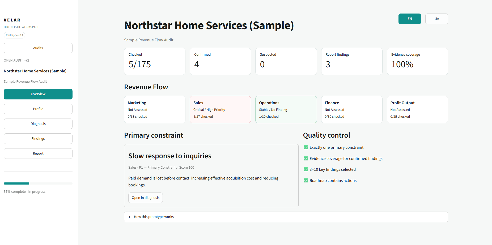
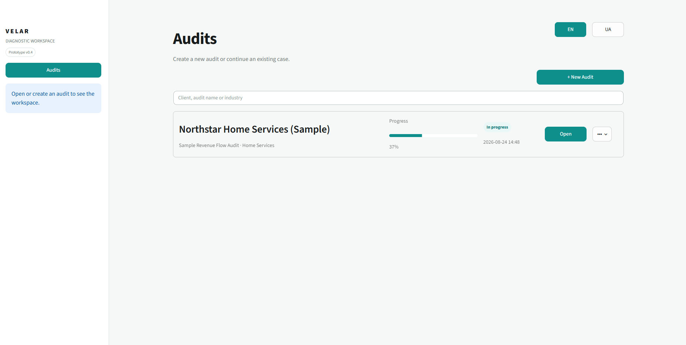
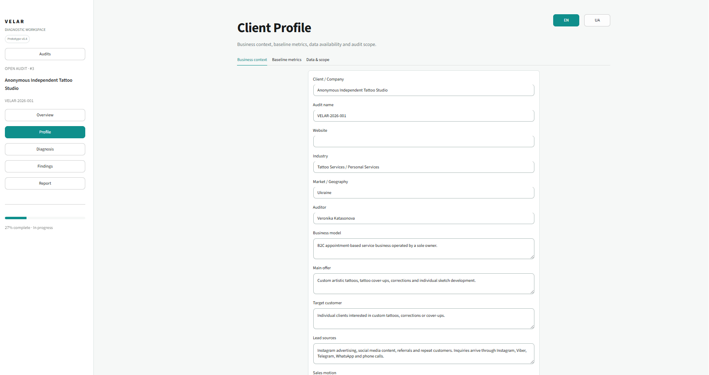
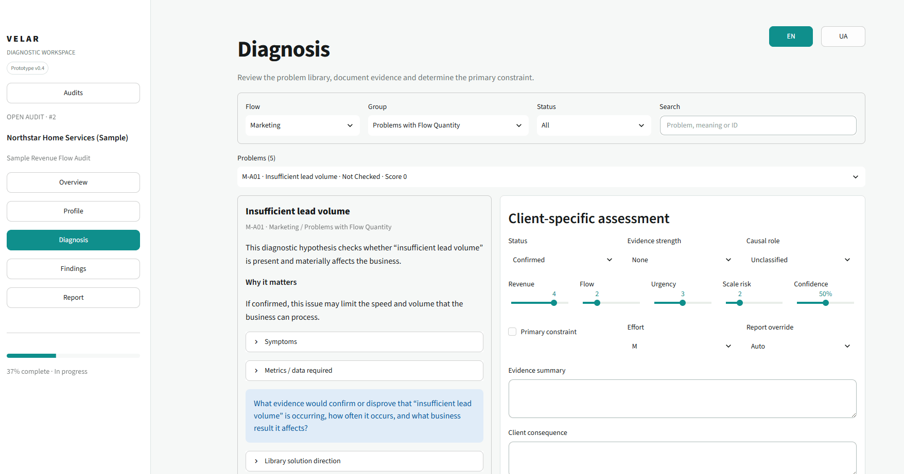
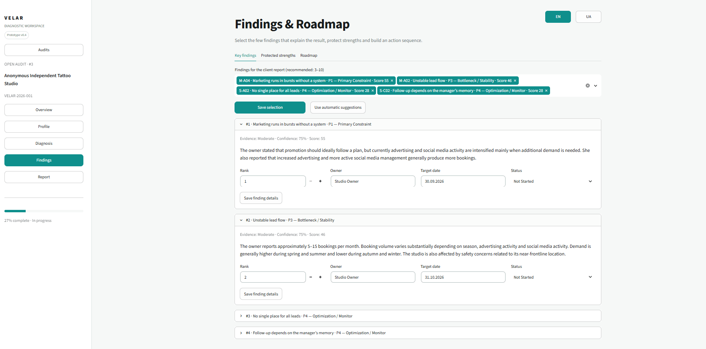
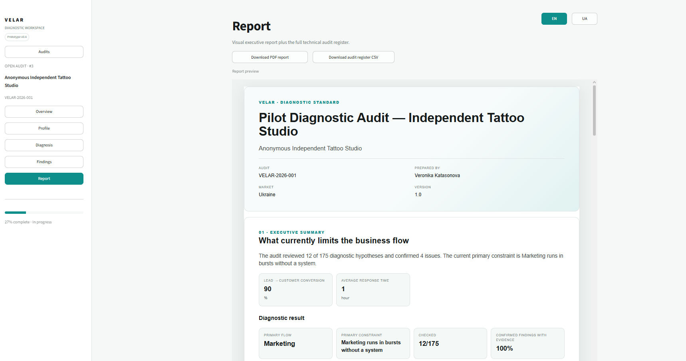

# Velar Diagnostic App

> **VELAR is the working title of an independently developed business diagnostic system.**

Velar Diagnostic App is a prototype of an internal tool I built for conducting structured business audits.

The project started as an Excel diagnostic playbook. I wanted to move the same workflow into a web application so that audits could be created, stored, reviewed and turned into a client report in one place.

The main idea behind the project is to look at a business as one connected flow:

**Marketing → Sales → Operations → Finance → Profit**

The application helps an auditor review possible problems across this flow, record evidence, evaluate their impact, identify the main constraint and build a prioritized action plan.

## Screenshots

### Overview



The overview shows audit progress and the current state of each part of the business flow.

### Audits



The main page contains saved audits and allows a new audit to be created.

### Client Profile



The client profile stores business context, business model, target customer, sales process, baseline metrics, audit scope and data availability.

### Diagnosis



This is the main audit workspace.

The current diagnostic library contains 175 possible problems divided across:

- Marketing
- Sales
- Operations
- Finance
- Profit Output

For each problem, the auditor can record its status, evidence, impact, confidence, causal role and recommendation.

### Findings and Roadmap



After the diagnosis, the auditor selects the most important findings, identifies one Primary Constraint and creates a sequence of actions.

### Report



The application generates an English PDF report with the main audit results and a separate full audit register.

## Real-business pilot validation

The diagnostic workflow was tested through an anonymous pilot audit of an operating independent tattoo studio in Ukraine.

The pilot was based on a structured written interview with the business owner and five additional clarification questions.

During the pilot:

- 12 of 175 relevant diagnostic hypotheses were reviewed;
- 4 findings were confirmed with documented evidence;
- one Primary Constraint was selected among the reviewed hypotheses;
- a ten-page diagnostic report was generated;
- a phased optimization roadmap was created.

After reviewing the report, the business owner confirmed that the identified constraint and conclusions corresponded to the real situation in the studio.

She considered the recommendations logical, realistic and suitable for gradual implementation, while noting that some actions would need to be adapted to the studio’s capacity and working schedule.

The pilot validates the diagnostic workflow, relevance of the prioritization and practical usability of the recommendations.

It does not yet demonstrate measured financial impact because the proposed actions have not been implemented and monitored over time.

- [View the anonymized pilot interview and validation evidence](docs/pilot_validation_evidence.pdf)
- [View the generated pilot diagnostic report](examples/VELAR_Anonymous_Independent_Tattoo_Studio_Report.pdf)

- [Methodology and venture background](docs/methodology_and_venture.md)
  
## Main features

- create and save separate audits;
- client profile and baseline metrics;
- library of 175 diagnostic problems;
- five connected business flows;
- evidence and file attachments;
- problem status tracking;
- impact scoring;
- Primary Constraint selection;
- causal role classification;
- key findings;
- protected strengths;
- optimization roadmap;
- PDF report generation;
- CSV audit register export;
- English and Ukrainian interface.

## Prioritization

Problems can be evaluated using four factors:

- **Revenue Impact — 35%**
- **Flow Restriction — 30%**
- **Urgency — 20%**
- **Scale Risk — 15%**

The calculation also takes problem status, evidence strength and auditor confidence into account.

The score helps with prioritization, but it does not automatically decide the root cause of a business problem. The auditor still determines the causal role and selects the Primary Constraint.

More details can be found in [`docs/scoring.md`](docs/scoring.md).

## Product boundaries

The application does not claim to analyse an entire business automatically.

- The auditor determines whether a problem is Confirmed, Suspected, Not Present or Not Applicable.
- The auditor records and evaluates the available evidence.
- The auditor assigns the causal role.
- The auditor selects the single Primary Constraint.
- The score supports prioritization but does not prove causality by itself.
- Conclusions must remain limited to the available evidence and audit scope.
- Uploaded attachments are stored and linked to problems, but their contents are not interpreted automatically.

The core methodology is:

**Evidence → Causal Analysis → Priority → Action**

## Tech stack

- Python
- Streamlit
- SQLite
- ReportLab
- JSON

The prototype runs locally and does not require paid infrastructure or external AI services.

## Project structure

```text
velar-diagnostic-app/
├── app.py
├── db.py
├── i18n.py
├── reporting.py
├── sample_case.py
├── seed_sample.py
├── data/
├── docs/
│   ├── images/
│   └── pilot_validation_evidence.pdf
├── examples/
│   ├── sample_report.pdf
│   └── VELAR_Anonymous_Independent_Tattoo_Studio_Report.pdf
├── assets/
│   └── screenshots/
├── tests/
├── requirements.txt
├── run_velar.bat
└── run_velar.ps1
```

## Running the project

On Windows, the easiest option is:

```text
run_velar.bat
```

The application will then be available at:

```text
http://localhost:8501
```

It can also be started through PowerShell:

```powershell
Set-ExecutionPolicy -Scope Process -ExecutionPolicy Bypass
.\run_velar.ps1
```

SQLite is included with Python. Local audit data are stored in `data/velar.db`, which is excluded from Git.

## Synthetic sample audit

The repository contains a fictional case called **Northstar Home Services** for testing the complete workflow without using real company data.

It can be added to the local database with:

```text
py seed_sample.py
```

A sample generated report is included here:

[`examples/sample_report.pdf`](examples/sample_report.pdf)

The synthetic case is separate from the anonymous real-business pilot described above.

## Current status

This is a functional prototype of the application.

The complete workflow from client profile to diagnosis, findings, roadmap and report is implemented.

The workflow has been tested through one anonymous real-business pilot. The pilot confirmed that the system can transform a structured owner interview into prioritized findings and a practical roadmap.

The project still needs:

- validation across additional businesses and industries;
- usability testing and interface simplification;
- stronger supporting evidence beyond owner interviews;
- measurement of implementation results over time.

My next priority would be improving the audit experience and expanding validation rather than adding unnecessary automation.

## License

Copyright © 2026 Veronika Katasonova. All rights reserved.

This repository is shared for portfolio and evaluation purposes.

No permission is granted to redistribute, modify or use the project commercially.
