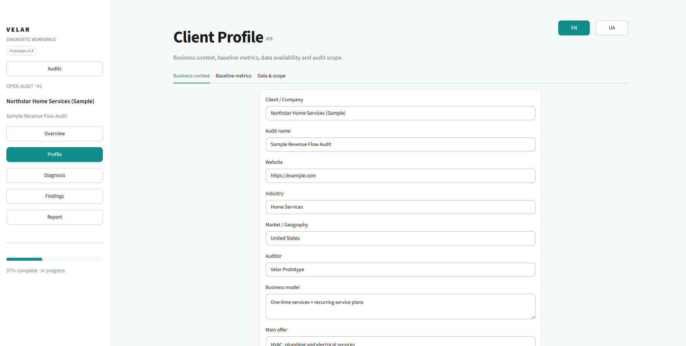
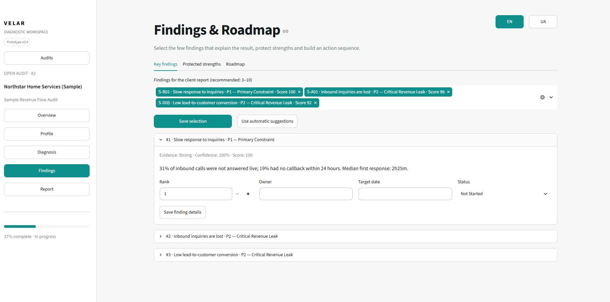
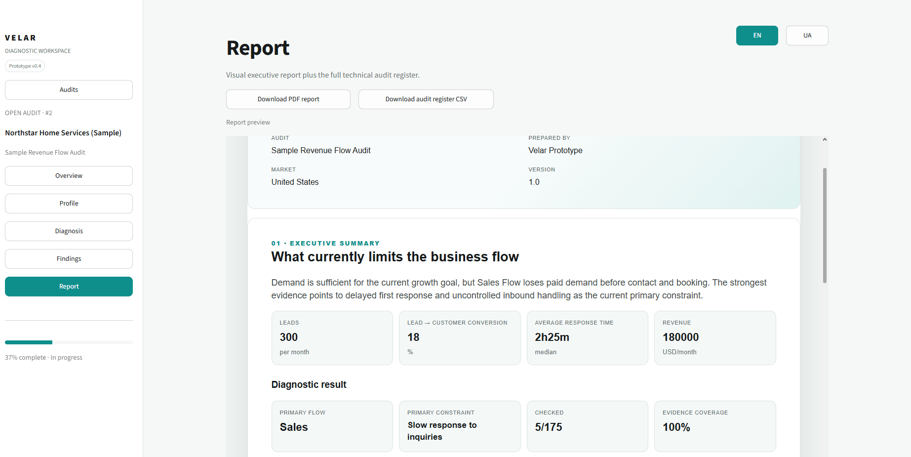

# Velar Diagnostic App

Velar Diagnostic App is a prototype of an internal tool I built for conducting structured business audits.

The project started as an Excel diagnostic playbook. I wanted to move the same workflow into a web application so that audits could be created, stored, reviewed and turned into a client report in one place.

The main idea behind the project is to look at a business as one connected flow:

**Marketing → Sales → Operations → Finance → Profit**

The application helps an auditor review possible problems across this flow, record evidence, evaluate their impact, identify the main constraint and build a prioritized action plan.

## Screenshots

### Overview


The overview shows audit progress and the current state of each part of the business flow.

### Audits


The main page contains saved audits and allows a new audit to be created.

### Client Profile



The client profile stores basic business context, business model, target customer, sales process, baseline metrics and data availability.

### Diagnosis


This is the main audit workspace.

The current diagnostic library contains 175 possible problems divided across:

* Marketing
* Sales
* Operations
* Finance
* Profit Output

For each problem, the auditor can record its status, evidence, impact, confidence, causal role and recommendation.

### Findings and Roadmap



After the diagnosis, the auditor selects the most important findings, identifies one Primary Constraint and creates a sequence of actions.

### Report



The application generates an English PDF report with the main audit results and a separate full audit register.

## Main features

* create and save separate audits;
* client profile and baseline metrics;
* library of 175 diagnostic problems;
* five business flows;
* evidence and file attachments;
* problem status tracking;
* impact scoring;
* Primary Constraint selection;
* causal role classification;
* key findings;
* protected strengths;
* optimization roadmap;
* PDF report generation;
* CSV audit register export;
* English and Ukrainian interface.

## Prioritization

Problems can be evaluated using four factors:

* **Revenue Impact — 35%**
* **Flow Restriction — 30%**
* **Urgency — 20%**
* **Scale Risk — 15%**

The calculation also takes problem status, evidence strength and auditor confidence into account.

The score helps with prioritization, but it does not automatically decide the root cause of a business problem. The auditor still determines the causal role and selects the Primary Constraint.

More details can be found in [`docs/scoring.md`](docs/scoring.md).

## Tech stack

* Python
* Streamlit
* SQLite
* ReportLab
* JSON

## Project structure

```text
velar-diagnostic-app/
├── app.py
├── db.py
├── i18n.py
├── reporting.py
├── sample_case.py
├── seed_sample.py
├── data/
├── docs/
├── examples/
├── assets/
│   └── screenshots/
├── tests/
├── requirements.txt
├── run_velar.bat
└── run_velar.ps1
```

## Running the project

On Windows, the easiest option is:

```text
run_velar.bat
```

The application will then be available at:

```text
http://localhost:8501
```

It can also be started through PowerShell:

```powershell
Set-ExecutionPolicy -Scope Process -ExecutionPolicy Bypass
.\run_velar.ps1
```

## Sample audit

I created a fictional case called **Northstar Home Services** to test the complete workflow without using real company data.

It can be added to the local database with:

```powershell
py seed_sample.py
```

A sample generated report is also included:

[`examples/sample_report.pdf`](examples/sample_report.pdf)

## Current status

This is the first functional version of the application.

The complete workflow from client profile to diagnosis, findings, roadmap and report is already implemented.

The project still needs usability testing and interface simplification. File attachments are currently stored and linked to audit problems, but their contents are not analyzed automatically.

My next priority would be improving the audit experience itself rather than adding more features.

